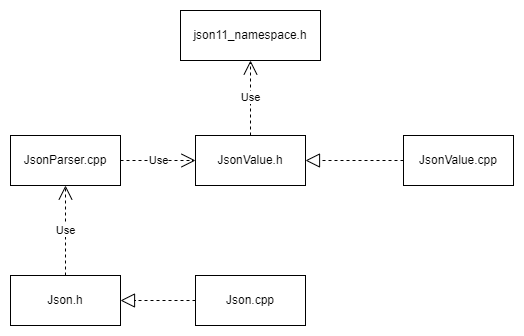
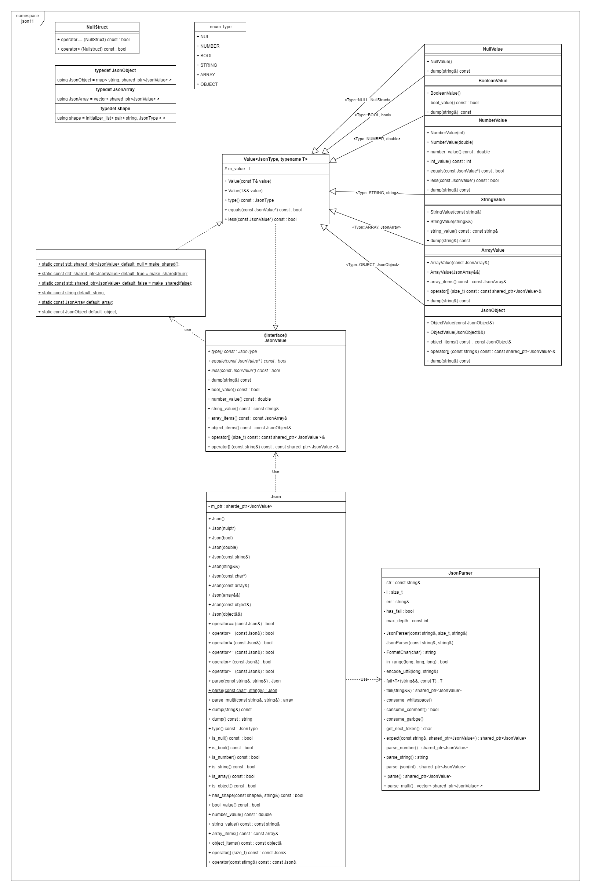
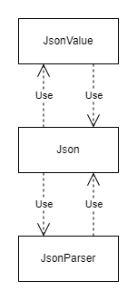
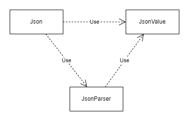

# 项目简介

本项目为基于C++11实现的Json库

能够实现从string解析为Json以及从Json转化为string两种主要功能


该项目本身仅为一个练习项目，其整体参考了他人的项目，并在其基础上进行了一定的重构

原版项目的github地址为：  [dropbox/json11: A tiny JSON library for C++11. (github.com)](https://github.com/dropbox/json11) 


文件引用图如下：



类图如下：



# 使用说明

**引入文件**

- json11_namespace.h
- JsonValue.h
- JsonValue.cpp
- JsonParser.cpp
- Json11.h
- Json11.cpp

**#include "json11.h"**

**(可选) using namespace json11**

具体使用

```c++
#include "json11.h"
using namespace json11;

// string解析为Json
const string str = R"([null, 1, true, ["string", {"key1" : "value1", "key2" : [false]}]])";
string err; 
const Json js = Json::parse(str, err);

cout << js.type() << endl;
cout << js.dump() << endl;
cout << js[3][1]["key2"][0].dump() << endl;

// 从Json解析为string
const Json js1;
cout << js1.type() << "  " << js1.dump() << endl;

const Json js2(1);
cout << js2.type() << "  " << js2.dump() << "  " << js2.int_value() << endl;

const Json js3(3.1415926);
cout << js3.type() << "  " << js3.dump() << "  " << js3.number_value() << endl;

const Json js4(true);
cout << js4.type() << "  " << js4.dump() << "  " << js4.bool_value() << endl;

const Json js5("this is a string");
cout << js5.type() << "  " << js5.dump() << "  " << js5.string_value() << endl;

const JsonArray ja{
	make_shared<NullValue>(),
	make_shared<BooleanValue>(false),
	make_shared<NumberValue>(100),
	make_shared<StringValue>("this is a array string")
};
const Json js6(ja);
cout << js6.type() << "  " << js6.dump() << endl;

const JsonObject jb{
	{ "key1" , make_shared<StringValue>("this is a object string") },
	{ "key2" , make_shared<ArrayValue>(ja) },
	{ "key3" , make_shared<NullValue>() }
};
const Json js7(jb);
cout << js7.type() << "  " << js7.dump() << endl;
```

# 重构经历（可以忽略）

**首先，必须要声明的是——尽管我对原版项目进行重构是因为我对原版项目的一些实现感到困惑，但这并不意味着原版项目是一个不好的项目，恰恰相反，原版项目作为一个基于C++11实现的Json库，其大量运用了C++11的一些特性，可以说是一个十分优秀的C++教学项目。但原版项目似乎过于想要丰富的C++11特性，这也导致了该项目代码在阅读起来有一种华而不实的感觉——这就好像是一幅使用了各种华丽色彩的画，虽然美丽，却又被色彩夺走了美**

**因此，我尝试着对本项目进行一定程度上的重构，一方面是对自己的重构能力以及代码能力进行练习，另一方面则是想要好好欣赏一下这幅美丽的画在刨除其想要表达的教学含义后的美**

本人最初在学习上述原版项目的时候，总觉得代码阅读起来有些难以理解，其中很重要的一个原因就是原版项目将所有代码仅存放在了两个文件中。

尽管C++并不要求每个类独占一个头文件，但毫无疑问，如果我们像编写Java或C#等语言一样让每一个类独占一个头文件，这会在很大程度上提高我们的代码阅读效率

（吐槽：C++的头文件与源文件与其他编程语言存在着很大的不同，尽管网上很多人说这样的设计有着不少优点，但在本人看来，利用头文件与源文件这种声明与实现分开的方式编写代码，远不如像Java和C#一样将声明与实现放在一起要来的好）

因此，本人重构的第一步，就是将**2个文件拆分为6个文件**

毫无疑问，这样的重构方式存在着明显的弊端——起初只需要在项目中导入2个文件，现如今却需要导入6个。但这样做的好处也显而易见，当我们阅读头文件时，我们可以在短时间内理解这个头文件中代码的含义。所以，这次重构在我看来是优大于劣的。

之后，我修改了Json六种数据类型的作用域到namespace json11下，同时也将NullStruct、array(JsonArray)、object(JsonObject)、shape等类型移动到namespace json11作用域下，并为它们单独生成了一个文件 **json11_namespace.h**

这样做其实除了能让代码好看以外没有什么好处，但我还是这样做了

我将JsonValue接口以及其他实现了该接口的类存放到一个文件JsonValue.h中。

同时我考虑到，原版项目中的从Json到string的实现，即**dump**（）函数的实现是通过多个位于namespace json11作用域下的dump重载函数实现的，这些重载函数在很大程度上又对应了JsonValue的实现类，因此我又将这些dump函数移动到了相应的Value实现类中

这样做的好处十分明显，就是逻辑上十分清晰。既然Value类负责存储实际的数据，那么就再由该类负责将自己内部的数据转化为string的形式。只是这样做似乎对性能有些影响（这里只是猜测，具体有没有我也不太清楚......）

至于**JsonParser**类型，我并没有进行多少重构，只是将原本的JsonParser从struct类型修改为了class类型，并将Json类中原本的parse()和parser_multi()接口的实现转移到了JsonParser中，作为公开接口以供外部调用，而将JsonParser内部原本的函数修改为private

其实最初的时候，我甚至想要将JsonParser中的in_range()、encode_utf8()等函数转移到一个单独的工具文件中以供外部调用。因为当时的我认为这些函数可以用在多种地方，就想着要将它们整合起来，只不过我后来还是放弃了，因为原本的文件数量已经够多了，如果再来一个新文件，而且还是一个在本项目中没有实际意义的文件的话，就影响了项目本身的美

同时，我还设想过，将JsonParser类型的parse功能像dump函数一样分割给各个Value实现类，但这样

至于Json类，由于它本身只是一个访问内部的接口，所以我基本没有进行重构


在重构工作初步完成之后，我又突发奇想......

在奇想之前，我们不妨看看本项目中类之间的原版引用关系图（大致如下）



Json的实现需要JsonParser与JsonValue，而JsonValue与JsonParser的实现又需要Json，这种相互嵌套的关系在我看来有些混乱，所以我突发奇想......

既然在本项目中，Json类本身只是一个负责访问的接口，而实际上的数据存储是由实现了JsonValue接口的Value类负责，那我们何不将JsonParser解析生成的对象从Json转变为JsonValue，同时不让JsonValue类返回Json类型对象，转而将从JsonValue对象到Json对象的操作交给Json接口实现呢？

似乎有些难以理解，我们直接看现在的类间引用关系图



这样的好处是在逻辑上更为直观

但这样却存在着一个至关重要的难题，那就是JsonValue本身只是一个接口，是不提供初始化对象操作的，因此我们无法直接生成JsonValue，只能生成指向JsonValue的智能指针shared_ptr\<JsonValue\>，这就是导致了我在重构过程中遇到的最大的难题——JsonArray与JsonObject的初始化

因为在原版中，JsonArray与JsonObject这两种别名的内部均通过Json这一类型实现，而Json类型又恰好有一系列完整的构造函数，因此我们在初始化这两种类型的时候，可以很方便地通过int，double，bool，string等类型初始化。

但现如今，为了不让JsonValue类返回Json对象，我对JsonArray和JsonObjet这两种别名进行了修改，让它们内部均通过shared_ptr\<JsonValue\>实现，这也就导致了，我们无法很方便地通过int，double，bool，string等类型初始化JsonArray与JsonObject，只能被迫通过make_ptr\<NullValue\>()、make_ptr\<BooleanValue\>(true)等操作进行初始化

不论是从一个使用者还是从一个开发者的角度来看，这种方式都让人十分厌烦，因此毫无疑问，这是以此失败的重构。但这并不意味着这次的重构毫无意义。

如果想要解决这个问题，目前我的思路大概有两个：一是将JsonArray与JsonObject从别名修改为两个完整的提供隐式转换的class；二则是对JsonValue进行修改。前者相比起来更为简单，但后者似乎更为有效。

只是碍于精力，这次重构我还并未进行。等到日后有时间的时候，一定会继续尝试对本项目进行重构。

不过我仍然可以大致说一下我第二种重构的思路：因为JsonValue本身只是一个接口类型，除了提供一些访问内部数据的接口外再没有什么其他作用，所以不妨将JsonValue给删去，将其中的接口函数放置到Value中。不过这样一来，似乎需要删去Value类的模板特性，将Value基类与其他的一些子类单纯地作为普通的类，而非模板类来实现


